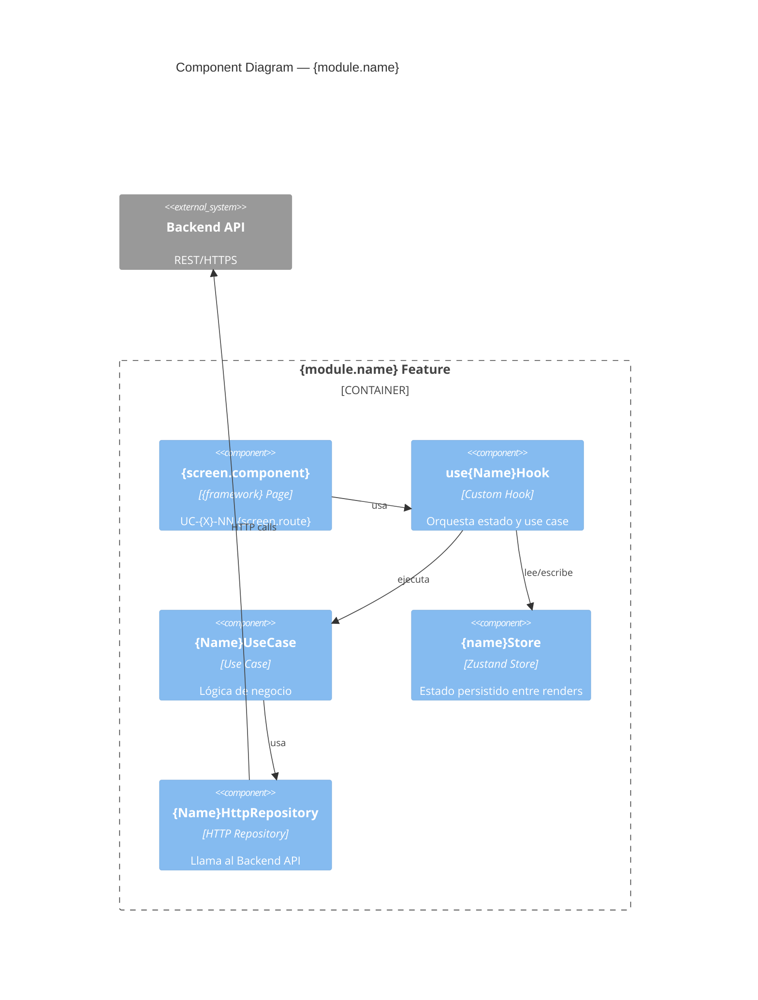

# Init Docs Frontend — Generar Documentación desde el Manifest

Genera toda la estructura `claude_workspace/` a partir de `project.manifest.yaml` para proyectos
**frontend** (React / Vue / Next.js / Nuxt). Paso previo y obligatorio antes de `/init-project-frontend`.

> **Cuándo usar:** una sola vez, al iniciar un proyecto frontend nuevo, después de llenar
> `project.manifest.yaml`. Si los docs ya existen, usar `/c4-update-diagrams` en su lugar.
>
> Para proyectos **backend/API** usar `/init-docs` en su lugar.

```
project.manifest.yaml  ──►  /init-docs-frontend  ──►  claude_workspace/ completo
                                                         ↓
                                                    /init-project-frontend  (código)
```

---

---

## Paso 0 — Leer y validar el manifest

```
Leer: claude_workspace/project.manifest.yaml
```

Verificar que las secciones mínimas requeridas existen y que `project.type = frontend`:

| Sección | Requerida | Qué extraer |
|---------|-----------|-------------|
| `project` | ✅ | `name`, `slug`, `tagline`, `type=frontend`, `dev_port`, `api_base_url` |
| `stack[]` | ✅ | lista con al menos `tech` y `version` |
| `actors[]` | ✅ | al menos un actor |
| `external_systems[]` | ✅ | al menos el backend API que consume |
| `infrastructure[]` | ✅ | al menos SPA |
| `architecture` | ✅ | `pattern`, `framework`, `features.*`, `coverage_threshold` |
| `modules[]` | ⚠️ opcional | puede estar vacío al inicio |
| `constraints[]` | ⚠️ opcional | si vacío → usar los RN-GLO-* estándar frontend |

Si `project.type != frontend` → detener y sugerir `/init-docs` (skill API).
Si falta alguna sección requerida → listar qué falta y detener sin crear archivos.

Escribir `SPEC_TYPE=frontend` en `claude_workspace/.env` (crear si no existe).

---

## Paso 1 — Detectar estado

Verificar si existe `claude_workspace/CLAUDE.md`:

| Estado | Acción |
|--------|--------|
| No existe | Crear todo (pasos 2–11) |
| Existe | Confirmar con el usuario antes de continuar. Si confirma → regenerar solo secciones centineladas via `/c4-update-diagrams`; no tocar archivos manuales |

---

## Paso 2 — Plan

Mostrar al usuario el plan antes de crear archivos:

```
## Plan /init-docs-frontend — {project.name}

### Archivos a crear
.claude/
├── CLAUDE.md                              (desde manifest)
claude_workspace/
├── TODO.md                                (desde manifest.modules)
├── .env                                   (SPEC_TYPE=frontend)
├── project.manifest.yaml                  (ya existe — no se toca)
│
├── architecture/
│   ├── context-diagram.md                 (desde manifest.actors + external_systems)
│   ├── container-diagram.md               (desde manifest.infrastructure + modules)
│   ├── component-diagram.md               (desde manifest.modules + screens + state)
│   ├── business-rules.md                  (RN-GLO-* frontend + índice de módulos)
│   └── feature_spec/
│       {por cada módulo en modules[]}
│       └── {spec_path}/spec.md            (scaffold mínimo — sin UCs aún)
│
├── rules/
│   ├── README.md, architecture.md, conventions.md, typescript.md
│   ├── documentation.md, solid.md, patterns.md, testing.md
│   ├── state-management.md, error-handling.md, configuration.md
│   ├── security.md, performance.md, tooling.md, git-cicd.md, general.md
│   └── (parametrizados con el stack del manifest)
│
└── guides/
    ├── development.md                     (variables de entorno del manifest)
    ├── testing.md                         (Vitest + Testing Library + Playwright)
    └── deployment-{platform}.md           (según manifest.deployment.platform)


¿Procedo? (s/n)
```

Solo continuar si el usuario confirma.

---

## Paso 3 — CLAUDE.md

Generar `CLAUDE.md` con la siguiente estructura:

```markdown
# {project.name}

> **Context:** {project.tagline}

---

## 📋 Documentación

### Arquitectura
- [📦 Contenedores](./claude_workspace/architecture/container-diagram.md) — C4 L2
- [🏗️ Componentes](./claude_workspace/architecture/component-diagram.md) — C4 L3
- [⚖️ Reglas de Negocio](./claude_workspace/architecture/business-rules.md) — RN-GLO-* y RN-{módulos}-*
- [📋 Contratos API](./claude_workspace/architecture/api_contracts/) — tipos derivados del backend

### Especificaciones por Módulo
<!-- generated:spec-links — NO EDITAR, regenerado por /c4-update-diagrams -->
{por cada módulo en modules[] con status != deprecated}
- [{icon} {name}](./claude_workspace/architecture/{spec_path})
<!-- /generated:spec-links -->

### Guías
- [👨‍💻 Desarrollo](./claude_workspace/guides/development.md)
- [🧪 Testing](./claude_workspace/guides/testing.md)
{si deployment.platform}
- [☁️ Despliegue {platform}](./claude_workspace/guides/deployment-{platform}.md)

### Reglas de Desarrollo ({framework} + TypeScript)
Referenciar los archivos de la carpeta ./claude_workspace/rules/, como ejemplo a continuacion:
- [📋 Índice](./claude_workspace/rules/README.md) · [🏗️ Arquitectura](./claude_workspace/rules/architecture.md)


### Progreso
- [✅ TODO](./claude_workspace/TODO.md) — estado de implementación por módulo

---

## 🚀 Quick Start

<!-- generated:quick-start — NO EDITAR, regenerado por /c4-update-diagrams -->
{comandos de manifest.quick_start.commands}
<!-- /generated:quick-start -->

- App: {manifest.quick_start.urls.app}

---

## 📦 Stack

<!-- generated:stack-table — NO EDITAR, regenerado por /c4-update-diagrams -->
| Tecnología | Versión | Propósito |
|------------|---------|-----------|
{por cada stack[]}
| {tech} | {version} | {purpose} |
<!-- /generated:stack-table -->

---

## 🔑 Reglas Críticas para Claude

> Reglas de negocio → business-rules.md y feature_spec/.
> Reglas técnicas → rules/.

### Constraints que NUNCA se pueden violar

<!-- generated:constraints-table — NO EDITAR, regenerado por /c4-update-diagrams -->
| Constraint | Detalle |
|-----------|---------|
{por cada constraints[]}
| **{name}** | {detail} |
<!-- /generated:constraints-table -->

### ❌ Qué nunca hacer

<!-- generated:never-do — NO EDITAR, regenerado por /c4-update-diagrams -->
{por cada never_do[]}
- ❌ {item}
<!-- /generated:never-do -->

---

### Informativo — Workflow de Skills

{diagramas Mermaid del flujo Spec→Impl→Quality — texto fijo estándar}

**Última actualización:** {fecha} · **Versión:** 1.0
```

---

## Paso 4 — Diagramas de arquitectura

Ejecutar la lógica de `/c4-update-diagrams all` para generar los tres diagramas.

### Diferencias clave en los diagramas frontend vs API

**context-diagram.md (C4 L1):**
- Actores: usuarios del browser, no sistemas backend
- Sistemas externos: el Backend API (consumido), Firebase Auth si aplica

**container-diagram.md (C4 L2):**
- Contenedor principal: SPA (React/Vue/Next)
- Infraestructura: CDN, hosting estático
- Relación: SPA → Backend API (HTTP REST), SPA → Firebase (Auth)

**component-diagram.md (C4 L3):**
Por cada módulo mostrar:


No incluir `PostgreSQL` ni ningún componente de infraestructura del backend — el frontend
solo conoce la API que consume.

Archivos generados:
- `architecture/context-diagram.md`
- `architecture/container-diagram.md`
- `architecture/component-diagram.md`

---

## Paso 5 — business-rules.md

Generar con la estructura estándar adaptada al frontend:

```markdown
# Reglas de Negocio — Globales y Transversales

> Este archivo contiene únicamente las reglas globales de frontend.
> Las reglas específicas de cada módulo están en sus specs.

## Índice de Módulos

| Módulo | Prefijo | Especificación |
|--------|---------|----------------|
{por cada módulo en modules[]}
| {name} | {rn_prefix} | [{spec_path}](./claude_workspace/feature_spec/{spec_path}/spec.md) |

---

## Convención de Nomenclatura

RN-{MÓDULO}-{NRO}
Módulos: {lista de rn_prefix del manifest} · GLO

---

## GLO — Reglas Globales Frontend

| ID | Descripción | Aplica a |
|----|-------------|----------|
| RN-GLO-001 | Las llamadas HTTP a la API solo ocurren dentro de los `HttpRepository` — nunca `fetch`/`axios` directo en componentes o hooks de negocio. | Features / Hooks |
| RN-GLO-002 | El estado compartido entre rutas vive en el store ({state_management}) — nunca en `useState` local para datos compartidos. | Store |
| RN-GLO-003 | Los tokens de autenticación se leen y escriben solo en `AuthRepository` — nunca en componentes, hooks ni use cases. | AuthRepository |
| RN-GLO-004 | Los errores HTTP 401 son interceptados globalmente en el `ApiClient` y redirigen a login — no capturar 401 a nivel de componente. | HttpClient interceptor |
| RN-GLO-005 | La validación de formularios usa {form_validation} en el Use Case o en el schema declarado — no inline en el componente. | Use Cases / Forms |
| RN-GLO-006 | Las URLs de la API se leen de `VITE_API_BASE_URL` — nunca hardcodeadas. | HttpRepository |
| RN-GLO-007 | Los tipos de dominio (types/) derivan del contrato de la API (`api_contracts/`) — no inventar propiedades no documentadas. | Types |
| RN-GLO-008 | No exponer errores técnicos crudos al usuario — mapear a mensajes comprensibles en el Use Case o en el error boundary. | Use Cases / UI |
{si architecture.features.i18n = true}
| RN-GLO-009 | Todos los textos visibles al usuario pasan por el sistema de i18n — nunca strings hardcodeados en JSX. | Components / Pages |

---

## Patrones de Verificación Automática

> Leídos por el skill `/rules-check`.

| ID | Scope | Tipo | Patrón (grep regex) | Corrección si falla |
|----|-------|------|---------------------|---------------------|
| RN-GLO-001 | `src/features/` | `forbidden` | `axios\.\|fetch\(` | Mover la llamada a un HttpRepository en `src/infrastructure/repositories/` |
| RN-GLO-003 | `src/features/` | `forbidden` | `localStorage\.getItem.*token\|cookie.*token` | Centralizar en AuthRepository |
| RN-GLO-006 | `src/infrastructure/` | `forbidden` | `http://\|https://` | Usar `import.meta.env.VITE_API_BASE_URL` |

---

## Estado de Implementación — Reglas Globales

| Regla | Descripción corta | Estado |
|-------|-------------------|--------|
{tabla con todas las RN-GLO generadas, estado inicial: ⏳ Pendiente}
```

---

## Paso 6 — api_contracts/

En lugar de `ddl.sql` y `migrations.sql`, generar:

```
architecture/api_contracts/
└── README.md
```

Con el siguiente contenido:

```markdown
# Contratos de API — {project.name}

> Tipos TypeScript derivados del contrato del Backend API.
> Fuente: {manifest.external_systems[backend_api].url}
>
> **Regla:** no inventar propiedades — derivar de la documentación Swagger del backend
> o del código del backend. [RN-GLO-007]

## Cómo actualizar estos contratos

1. Abrir la documentación del backend: {api_base_url}/docs
2. Para cada endpoint, extraer los tipos de request/response
3. Crear o actualizar el archivo `{módulo}.types.ts` correspondiente

## Archivos por módulo

{por cada módulo en modules[]}
- `{module.id}.types.ts` — tipos de {module.name}

---

## Convención de naming

```typescript
// Request types — sufijo Request
export interface CreateProductRequest { ... }

// Response types — sufijo Response
export interface ProductResponse { ... }
export interface ProductListResponse { ... }

// Enums del dominio — igual que el backend
export enum ProductStatus { ACTIVE = 'ACTIVE', INACTIVE = 'INACTIVE' }
```
```

Crear un archivo `{module.id}.types.ts` vacío (scaffold) por cada módulo con:

```typescript
/**
 * API contract types for {module.name}.
 * Derived from: {api_base_url}/docs#{module.id}
 *
 * @remarks Update this file when the backend API contract changes.
 */

// TODO: definir tipos derivados del contrato de la API
export {};
```
---

## Paso 7 — TODO.md

```markdown
# TODO — Estado de Implementación

> **Última actualización:** {fecha}
> **SPEC_TYPE:** frontend

---

{por cada módulo en modules[]}
## Módulo: {name} (`{spec_path}`)

| UC-ID | Pantalla | Ruta | Spec | Impl | Tests | Estado |
|-------|---------|------|------|------|-------|--------|
{por cada screen en module.screens[]}
| {uc} | {screen.component} | `{screen.route}` | ⏳ | ⏳ | ⏳ | 📐 Pendiente spec |

---

## Leyenda

| Símbolo | Significado |
|---------|-------------|
| ✅ | Completado |
| ⏳ | Pendiente |
| 🚧 | En progreso |
| ❌ | Bloqueado |
| 📐 | Solo spec |
| 🔲 | Sin iniciar |
```

---

## Paso 8 — rules/

Generar los archivos de reglas adaptados al stack frontend del manifest.
Los archivos con diferencias sustanciales respecto al API:

### `rules/architecture.md` — Flujo de Implementación Frontend

Contiene el **Flujo de Implementación** y el **Path Registry** adaptados al patrón frontend:

**Flujo de Implementación (orden canónico de artefactos):**

| # | Artefacto | Clave Path Registry | Responsabilidad |
|---|-----------|---------------------|----------------|
| 1 | Domain Types | `types` | Interfaces/tipos de dominio — sin dependencias de framework |
| 2 | HTTP Port | `http_ports` | Interfaz del repositorio HTTP — contrato que el use case exige |
| 3 | Use Case | `use_cases` | Lógica de negocio — orquesta repositorio y validaciones |
| 4 | HTTP Repository | `http_repos` | Implementación del port — hace las llamadas HTTP reales |
| 5 | Store | `store` | Estado Zustand del módulo — solo si hay estado compartido |
| 6 | Hook | `hooks` | Orquesta use case + store + loading/error para el componente |
| 7 | Components | `components` | Componentes presentacionales del módulo |
| 8 | Page | `pages` | Componente de ruta — solo compone, no tiene lógica |
| 9 | Unit Test | `test_unit` | Tests con Testing Library + Vitest |
| 10 | E2E Test | `test_e2e` | Tests de flujo completo con Playwright |

**Path Registry** (ajustar según el framework del manifest):

```markdown
## 🗂️ Path Registry

| Clave | Path |
|-------|------|
| `types`      | `src/core/domain/types` |
| `exceptions` | `src/core/domain/exceptions` |
| `use_cases`  | `src/core/application/use-cases` |
| `http_ports` | `src/core/application/ports` |
| `http_repos` | `src/infrastructure/repositories` |
| `api_client` | `src/infrastructure/http` |
| `pages`      | `src/features/{module}/pages` |
| `components` | `src/features/{module}/components` |
| `hooks`      | `src/features/{module}/hooks` |
| `store`      | `src/features/{module}/store` |
| `test_unit`  | `test/unit` |
| `test_e2e`   | `test/e2e` |
```

> Para Next.js: `pages` → `src/app/{module}/page.tsx` (App Router) o `src/pages/{module}.tsx` (Pages Router).

**Module Registry:**

| Alias(es) | Carpeta spec | Sufijo de ruta | Prefijo UC |
|-----------|-------------|----------------|-----------|
{por cada módulo en modules[]}
| `{id}` | `{spec_path}` | `{id}/` | `{uc_prefix}-*` |

### `rules/state-management.md` — NUEVO (no existe en API)

Reglas específicas del estado global:

```markdown
# Estado Global ({state_management})

## Cuándo usar el store vs useState local

| Situación | Usar |
|-----------|------|
| Datos compartidos entre múltiples páginas/rutas | Store |
| Datos de sesión/auth | Store (AuthStore) |
| Estado de UI local (modal abierto, tab activo) | useState |
| Estado de formulario en progreso | useState / useForm |
| Cache de respuestas de API | Store con TTL |

## Estructura de un store Zustand

{ejemplo canónico con estado, acciones, selectors y reset}

## Reglas de naming

- Store: `{nombre}Store` (camelCase) en `{module}/store/{nombre}.store.ts`
- Actions: verbos en imperativo (`fetchProducts`, `addToCart`, `clearAuth`)
- Selectors: `use{Nombre}` hooks derivados del store
```

---

## Paso 9 — guides/

### `guides/development.md`

- **Setup inicial:** comandos de `manifest.quick_start.commands`
- **Variables de entorno:** derivadas del manifest
  ```env
  VITE_API_BASE_URL=http://localhost:3000/api
  {si firebase} VITE_FIREBASE_API_KEY=...
  {si firebase} VITE_FIREBASE_PROJECT_ID=...
  ```
- **Estructura de directorios:** feature-first según `architecture.pattern`
- **Proxy de desarrollo:** configuración Vite para evitar CORS en dev
- **Troubleshooting:** sección vacía con marcador

### `guides/testing.md`

- Vitest config + Testing Library setup
- MSW para mockear endpoints del backend en tests
- Playwright config + ejemplo de test E2E de login
- Threshold: `{architecture.coverage_threshold}%`

### `guides/deployment-{platform}.md`

- `gcp` → Cloud Storage + Cloud CDN + Cloud Run (SSR)
- `vercel` → `vercel.json` + env vars
- `netlify` → `netlify.toml` + redirects para SPA
- `aws` → S3 + CloudFront
- otro → template genérico Docker multi-stage build

---

## Paso 10 — commands/

Copiar todos los skills del workflow adaptados al frontend.
Verificar que cada skill tenga en cuenta `SPEC_TYPE=frontend`.

`init-docs-frontend.md` (este), `init-project-frontend.md`, `spec-code.md`,
`spec-code-validate.md`, `spec-create.md`, `spec-validate.md`,
`rules-create.md`, `test-coverage.md`, `rules-check.md`,
`sync-todo.md`, `c4-update-diagrams.md`, `spec-pipeline.md`,
`bulk-spec.md`, `bulk-implement-seq.md`, `bulk-implement-par.md`, `bulk-quality.md`

---

## Paso 11 — Reporte final

```
## /init-docs-frontend completado — {project.name}

### Archivos generados

| Sección | Archivos | Estado |
|---------|----------|--------|
| CLAUDE.md | 1 | ✅ |
| .env (SPEC_TYPE=frontend) | 1 | ✅ |
| Diagramas C4 | 3 (context, container, component) | ✅ |
| business-rules.md | 1 | ✅ |
| api_contracts/ | {N} scaffolds de tipos | ✅ |
| feature_spec/ | {N} specs (uno por módulo) | ✅ |
| TODO.md | 1 | ✅ |
| rules/ | 17 archivos (16 base + state-management.md) | ✅ |
| guides/ | 2-3 archivos | ✅ |
| commands/ | 16 archivos | ✅ |

### Módulos registrados: {N}
{lista con uc_prefix y número de screens de cada módulo}

### SPEC_TYPE configurado
claude_workspace/.env → SPEC_TYPE=frontend
(todos los skills /spec-create, /spec-code, /spec-validate usarán la variante frontend)

### Próximos pasos
1. Completar `architecture/api_contracts/{módulo}.types.ts` con los tipos del backend
2. `/init-project-frontend`  →  scaffolding de código {framework}
3. `/spec-create UC-{PREFIJO}-01`  →  especificar la primera pantalla
```

---

## Qué NO hace este skill

| Responsabilidad | Skill correcto |
|----------------|---------------|
| Crear `src/` o cualquier archivo TypeScript/TSX | `/init-project-frontend` |
| Especificar UCs con flujos y reglas | `/spec-create` |
| Definir los tipos del contrato API | Manual (derivar del Swagger del backend) |
| Actualizar docs cuando el manifest cambia | `/c4-update-diagrams` |
| Crear migraciones de BD | N/A — el frontend no tiene BD propia |
