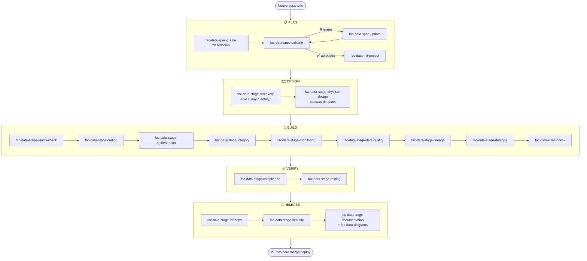

# Commands — Flujo de Desarrollo de Datos ITC

Commands para ejecutar el flujo de fábrica de datos. Cada command lee `docs/specs/*.yaml`
como fuente de verdad y aplica los estándares del dominio `data/`.

Prefijo de todos los comandos: **`fac-data-`** (factory + data tower).
Patrón: `fac-{tower}-{level}-{name}` — evita colisiones con otros MCPs, contextos y skills de Claude.

> **Invocación:** estos commands se ejecutan **vía MCP** (`itcm-knowledge`) — no son slash commands
> locales de Claude Code. Referencia correcta: `fac-data-spec-validate` (sin `/`).
> Claude los resuelve llamando a la herramienta MCP correspondiente, no con un comando local.

---

## Comandos Phase — ejecutan un bloque completo de etapas

| Command | Bloque | Qué ejecuta |
|---|---|---|
| `fac-data-phase-design` | DESIGN | `DISCOVERY` (solo si el `type` tiene `fuentes[]`) → `PHYSICAL_DESIGN` → `sync-todo` |
| `fac-data-phase-build` | BUILD + VERIFY + RELEASE | `reality-check` → `CODING` → `ORCHESTRATION` → `INTEGRIDAD` → `MONITORING` → `DATA_QUALITY` → `LINEAGE` → `DATAOPS` → `rules-check` → `COMPLIANCE` → `sync-todo` → `INFRAOPS` → `SECURITY` → `DOCUMENTATION` → `sync-todo` → `TESTING` |

> Los phase commands leen `etapas` del spec y omiten automáticamente las etapas marcadas `false`.

---

## Comandos Atómicos — control etapa por etapa

### PLAN

| Command | Cuándo usar |
|---|---|
| `fac-data-spec-create` | Iniciar un desarrollo — crea `docs/specs/*.yaml` scaffoldeado |
| `fac-data-spec-validate` | Auditar el spec (YAML) antes de avanzar de etapa |
| `fac-data-spec-update` | Cambio quirúrgico a un campo del spec |
| `fac-data-init-project` | Scaffold inicial del repo (carpetas + deploy configs + docs). No genera código placeholder |

### DESIGN

| Command | Cuándo usar |
|---|---|
| `fac-data-stage-discovery` | Sub-etapa — resolver tablas canónicas, generar/cargar glosarios BigQuery. Solo si el módulo declara `fuentes[]` |
| `fac-data-stage-physical-design` | Sub-etapa — contrato de datos: DDL físico (BigQuery o PostgreSQL). **No** genera skeletons de código |

### BUILD

| Command | Cuándo usar |
|---|---|
| `fac-data-stage-reality-check` | Contrastar el spec contra el repo y el framework Dataops — primer paso de BUILD |
| `fac-data-stage-coding` | Crear el código del módulo: SP con lógica completa, FastAPI, componentes KFP |
| `fac-data-stage-orchestration` | Cloud Workflow + Cloud Scheduler |
| `fac-data-stage-integrity` | Gate de integridad de fuentes: actualidad D-1, duplicados, llaves nulas (si `integridad: true`) |
| `fac-data-stage-monitoring` | Scripts matrícula proceso+tareas vía API (si `monitoring: true`) |
| `fac-data-stage-data-quality` | SP DQ + registros dq_config |
| `fac-data-stage-lineage` | Scripts registro nodos/aristas/columnas vía API (si `lineage: true`) |
| `fac-data-stage-dataops` | `env_*.json` + `deploy_*.json` — cierra BUILD |

### VERIFY

| Command | Cuándo usar |
|---|---|
| `fac-data-rules-check` | Verificar SQL/YAML/Python contra todos los estándares |
| `fac-data-stage-compliance` | Auditoría estática del código — reporte `docs/reports/compliance-*.md` |
| `fac-data-stage-testing` | Validación dinámica en dev vía MCP BigQuery (post-despliegue) |

### RELEASE

| Command | Cuándo usar |
|---|---|
| `fac-data-stage-infraops` | YAMLs SAs + IAM + `deploy/infra_*.json` |
| `fac-data-stage-security` | Auditoría permisos, PII, hash iden_party, SA tipo correcto |
| `fac-data-stage-documentation` | Catálogo de datos + glosario + diagramas + README del repo — cierra el módulo |

### MANTENIMIENTO

| Command | Cuándo usar |
|---|---|
| `fac-data-sync-todo` | Sincronizar `docs/TODO.md` con el estado real del repo |
| `fac-data-diagrams` | Generar o sincronizar los diagramas de arquitectura. Lo invoca DOCUMENTATION; suelto sirve como mantenimiento |

---

## Flujo completo



---

## Flujo resumido

### Con phase commands (recomendado)

```
fac-data-spec-create "Atributo de nivel educativo"   ← PLAN completo
fac-data-phase-design                                ← DESIGN completo
fac-data-phase-build                                 ← BUILD + VERIFY + RELEASE completos
```

### Con commands atómicos (control etapa por etapa)

```
# ── PLAN ─────────────────────────────────────────────────────────
fac-data-spec-create "Atributo de nivel educativo"
fac-data-spec-validate
fac-data-spec-update "contexto: completar data_owner y kpis"
fac-data-spec-validate              ← hasta que esté aprobado

fac-data-init-project               ← una sola vez

# ── DESIGN ───────────────────────────────────────────────────────
fac-data-stage-discovery            ← solo si el módulo declara fuentes[]
fac-data-stage-physical-design      ← contrato de datos (DDL)

# ── BUILD ────────────────────────────────────────────────────────
fac-data-stage-reality-check              ← contrastar spec vs repo antes de escribir código
fac-data-stage-coding
fac-data-stage-orchestration
fac-data-stage-integrity           ← si integridad: true
fac-data-stage-monitoring          ← si monitoring: true
fac-data-stage-data-quality
fac-data-stage-lineage             ← si lineage: true
fac-data-stage-dataops             ← cierra BUILD: deploy configs + env vars
fac-data-rules-check

# ── VERIFY ───────────────────────────────────────────────────────
fac-data-stage-compliance
fac-data-sync-todo

# ── RELEASE ──────────────────────────────────────────────────────
fac-data-stage-infraops            ← SAs, roles IAM y permisos GCP
fac-data-stage-security
fac-data-stage-documentation
fac-data-sync-todo

# ── TESTING (post-despliegue dev) ────────────────────────────────
# (activar testing: true en el spec con fac-data-spec-update)
fac-data-stage-testing
```

---

## Fuentes de verdad que leen los commands

| Command | Lee |
|---|---|
| Todos | `docs/specs/*.yaml` |
| `fac-data-spec-create` | `@.claude/data/standard/factory/spec-manifest.md`, `project.manifest.yaml` (si existe) |
| `fac-data-spec-validate` | `@.claude/data/standard/factory/spec-manifest.md` |
| `fac-data-spec-update` | `docs/specs/*.yaml` |
| `fac-data-stage-discovery` | `@.claude/data/skills/analysis/data-catalog-bq-generator/SKILL.md`, `@.claude/data/data_catalog/`, `deploy/env_dev.json` |
| `fac-data-init-project` | `@.claude/data/standard/factory/repositories.md`, `@.claude/data/skills/build/dataops/dataops-configurator/SKILL.md` |
| `fac-data-stage-coding` | `@.claude/data/standard/bigquery/development.md`, `@.claude/data/standard/bigquery/nomenclatura-retail.md` |
| `fac-data-stage-data-quality` | `@.claude/data/standard/data-quality.md` |
| `fac-data-stage-integrity` | `@.claude/data/standard/data-integrity.md`, `@.claude/data/standard/services/workflow.md` |
| `fac-data-stage-orchestration` | `@.claude/data/standard/services/workflow.md` |
| `fac-data-stage-dataops` | `@.claude/data/skills/build/dataops/dataops-configurator/SKILL.md` |
| `fac-data-stage-infraops` | `@.claude/data/skills/release/infraops-configurator/SKILL.md`, `@.claude/data/standard/services/service-accounts.md` |
| `fac-data-rules-check` | Todos los estándares relevantes según tipo de archivo |
