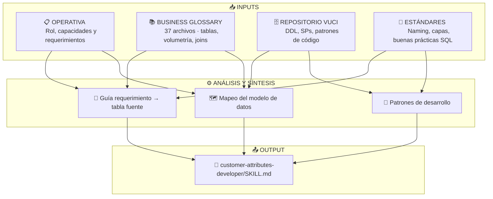
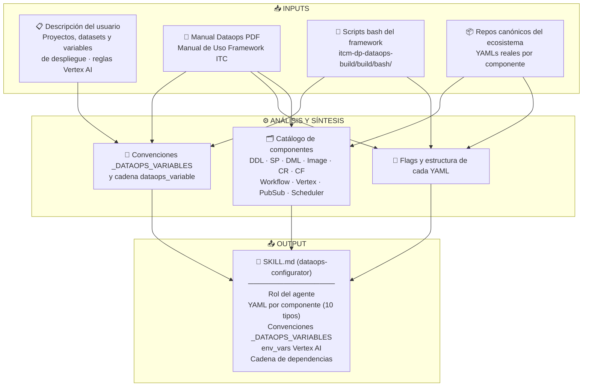
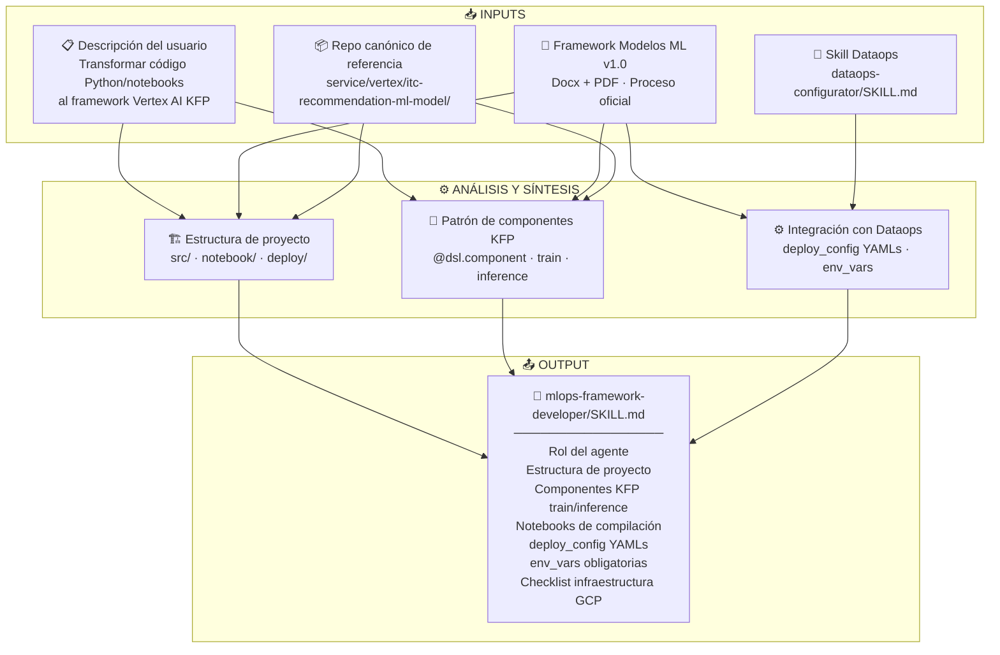

# Cómo se construyeron los skills

---

## `customer-attributes-developer/SKILL.md`

| Input | Qué aportó |
|---|---|
| **Descripción del usuario** | Rol, capacidades (desarrollo y mantenimiento de atributos), alcance sin insights |
| **Catálogo de Datos** | Mapa de tablas: volumetría, particiones, campos de JOIN, guía requerimiento→tabla |
| **Scripts reales del repo** | Patrón `EXECUTE IMMEDIATE`, firma de SPs, cadena tmp, DDL `ALTER TABLE` |
| **Estándares knowledge-base** | Naming, capas de arquitectura, buenas prácticas BigQuery |

> Renombrado desde `insights-attr-dev-agent.md` — eliminadas capacidades de generación de insights e identificación de segmentos. Brief Técnico se incorporó como sección obligatoria.

---

## `dataops-configurator/SKILL.md`

| Input | Qué aportó |
|---|---|
| **Descripción del usuario** | Estructura de proyectos/datasets, variables de despliegue, reglas Vertex AI |
| **Manual Dataops PDF** | Flujo completo del framework, componentes soportados, orden de ejecución |
| **Scripts bash del framework** | Flags exactos por componente, parámetros requeridos vs. opcionales |
| **Repos canónicos** | YAMLs reales, patrones `dataops_variable`, `env_vars` de producción |

---

## `mlops-framework-developer/SKILL.md`

| Input | Qué aportó |
|---|---|
| **Descripción del usuario** | Objetivo: transformar código externo al framework ITC; casos de uso |
| **Framework Modelos ML v1.0** | Proceso oficial, estructura de carpetas, convenciones KFP, checklist GCP |
| **Repo canónico** | Estructura real de `src/components.py`, notebooks de compilación, YAMLs reales |
| **Skill Dataops** | Integración con el framework de despliegue: `deploy_config`, `env_vars`, `vertex_pipeline` |
