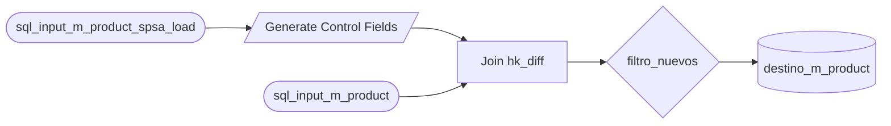

# Skill: Matillion Pipeline Mapper

> **Rol:** Mapeador de Pipelines Matillion → 4 Documentos MD Estructurados
>
> **Salida:** 4 documentos MD (lógica de negocio, SQLs por tipo, mapa de orquestación Mermaid, brief funcional)
>
> **Propósito:** Análisis completo de exportaciones Matillion para migración a factory flow GCP

---

## Resumen Ejecutivo

El **Matillion Pipeline Mapper** analiza exportaciones JSON de Matillion ETL y genera **4 documentos Markdown** que cubren el análisis completo del pipeline y el requerimiento para la fábrica de datos:

| Documento | Archivo | Propósito |
|---|---|---|
| Lógica de Negocio | `logica-negocio-{stem}.md` | Visión técnica del pipeline: fuentes, destino, variables, componentes |
| SQL Statements | `sql-statements-{stem}.md` | Toda la lógica extraída por tipo: SQL, CALCULATOR, FILTER, JOIN, TABLE_OUTPUT |
| Mapa de Orquestación | `orchestration-map-{stem}.md` | Grafo real del pipeline en formato Mermaid con colores por tipo |
| Brief Funcional | `functional-brief-{stem}.md` | Requerimiento completo listo para entregar al flujo de fábrica |

**Output:** 4 archivos `.md` en `{output}/{json-stem}/` (nombres en minúsculas con guiones)

---

## 1. Instalación

```bash
# Requisitos
Python 3.10+

# ✅ NO requiere dependencias externas — 100% standalone
# ✅ Incluye preprocesador integrado (elimina ruido UI, aplana parámetros)
# ✅ Usa solo stdlib: json, argparse, re, pathlib, typing, collections, datetime
```

---

## 2. Uso

```bash
python mapper.py \
  --input ruta/al/export.json \
  --output carpeta/salida/
```

**Output generado:**
```
carpeta/salida/export/
├── logica-negocio-export.md
├── sql-statements-export.md
├── orchestration-map-export.md
└── functional-brief-export.md
```

**Batch (múltiples JSONs):**
```bash
for json in input/*.json; do
  python mapper.py --input "$json" --output output/
done
```

---

## 3. Tipos de Componentes Extraídos

El mapper detecta automáticamente 6 tipos de componentes Matillion por `implementationID`:

| Tipo | implementationID | Qué extrae |
|---|---|---|
| `SQL_QUERY` | -1266674941 | SQL completo (SELECT, INSERT, MERGE, etc.) |
| `CALCULATOR` | 1716658327 | Pares `{expresión BigQuery → columna destino}` |
| `FILTER` | -1760161015 | Condiciones WHERE + operador AND/OR |
| `JOIN` | -629958239 | Tipo, inputs, condición SQL, column mapping |
| `TABLE_OUTPUT` | 211954775 | Tabla destino, tipo de carga, column mapping |
| `SORT_RERANK` | -1099429750 | Nombre del componente (sort/merge keys) |

---

## 4. Documentos Generados

### 4.1 Lógica de Negocio (`logica-negocio-{stem}.md`)

- Resumen ejecutivo: jobs, componentes, variables, statements
- **Fuentes de entrada:** nombres reales de componentes SQL_QUERY (no regex — Matillion usa `$T{}`)
- **Tablas destino:** extraídas de TABLE_OUTPUT (tabla, proyecto, tipo de carga)
- **Variables de configuración:** `${prm_*}` embebidas en SQLs + variables declaradas en Matillion
- Listado de jobs con ID y conteo de componentes
- Patrones por tipo de componente (CALCULATOR, FILTER, JOIN, TABLE_OUTPUT, SQL_QUERY)
- Diagrama ASCII de flujo general

### 4.2 SQL Statements (`sql-statements-{stem}.md`)

Organizado por tipo de componente con secciones independientes:

**SQL_QUERY** — SQLs completos sin truncación, organizados por subtipo (SELECT/INSERT/MERGE/etc.) y empresa detectada

**CALCULATOR** — Tabla de expresiones BigQuery por columna destino:
```
| Columna Destino      | Expresión                                        |
| process_date_2       | CURRENT_DATE('America/Lima')                     |
| load_date_2          | TIMESTAMP(EXTRACT(DATETIME FROM CURRENT_TIMESTAMP() AT TIME ZONE 'America/Lima')) |
| load_user_2          | SESSION_USER()                                   |
| hkdiff_new           | sha256(IFNULL(...) || IFNULL(...))               |
```

**FILTER** — Condiciones con operador lógico:
```
Lógica: AND
| Columna              | Operador | Valor |
| b_product_item_sku   | Is       | Null  |
```

**JOIN** — Tipo, inputs, condición SQL completa, column mapping:
```sql
`a`.`itc_company_id` = `b`.`itc_company_id` AND
`a`.`product_id` = `b`.`product_id` AND ...
```

**TABLE_OUTPUT** — Tabla destino, tipo de carga, mapeo columna origen → destino

### 4.3 Mapa de Orquestación (`orchestration-map-{stem}.md`)

Diagrama **Mermaid `flowchart LR`** generado desde la estructura real de conectores del JSON (`job["connectors"]`):

- Nodos con formas según tipo: SQL=`([...])` CALC=`[/.../]` FILTER=`{...}` JOIN=`[...]` TABLE_OUTPUT=`[(...)]` SORT=`[[...]]`
- Colores por `classDef`: azul=SQL, verde=CALC, naranja=FILTER, violeta=JOIN, rojo=TABLE_OUTPUT, teal=SORT
- Un diagrama por job (transformation + orchestration)
- Resumen de componentes por tipo

**Ejemplo de output:**


### 4.4 Brief Funcional (`functional-brief-{stem}.md`)

Sigue el estándar `@data/standard/factory/functional-brief.md` con **12 secciones**:

| # | Sección | Fuente en mapper |
|---|---|---|
| 1 | Identificación | Nombre del job + empresa detectada + fecha |
| 2 | Objetivo de Negocio | Nombre del pipeline + tabla destino + periodicidad |
| 3 | Actores y Stakeholders | Placeholders (requiere datos del solicitante) |
| 4 | Casos de Uso | Flujo construido desde los componentes reales |
| 5 | Diagrama de Flujo | Mermaid real del pipeline (mismo que orchestration-map) |
| 6 | Fuentes de Datos | SQL_QUERY comp_names + **SQLs completos embebidos** |
| 7 | Output Esperado | TABLE_OUTPUT: tabla, proyecto, tipo carga, column mapping |
| 8 | Reglas de Negocio | JOIN conditions + FILTER conditions + CALCULATOR expressions |
| 9 | Frecuencia y Volumen | **Periodicidad detectada del nombre del archivo** |
| 10 | Criterios de Aceptación | Criterios estándar de migración |
| 11 | Fuera de Alcance | Placeholders estándar |
| 12 | Adjuntos / Referencias | Links a los otros 3 MDs generados |

**El brief es autocontenido** — incluye los SQLs de entrada completos para que el ingeniero pueda escribir el SP sin abrir otros archivos.

#### Detección de periodicidad desde el nombre del archivo

El mapper extrae la frecuencia directamente del stem del JSON:

| Keyword en nombre | Periodicidad detectada |
|---|---|
| `diario` / `diaria` | Diario |
| `semanal` | Semanal |
| `quincenal` | Quincenal |
| `mensual` | Mensual |
| `bimestral` | Bimestral |
| `trimestral` | Trimestral |
| `semestral` | Semestral |
| `anual` | Anual |
| _(ninguna)_ | Mensual (default) |

---

## 5. Integración con Factory Flow

```
Matillion Export JSON
        ↓
[mapper.py]  ← Este skill
        ↓
4 Documentos Markdown en {output}/{stem}/
├── logica-negocio-*.md       ← Visión técnica del pipeline
├── sql-statements-*.md       ← Toda la lógica extraída por tipo
├── orchestration-map-*.md    ← Grafo Mermaid real
└── functional-brief-*.md     ← Requerimiento para fábrica ✅ autocontenido
        ↓
Completar campos _(completar)_ del brief
(solicitante, data owner, volumetría, día/hora de ejecución)
        ↓
[/spec-create]  ← El ingeniero traduce el brief al spec.yaml
        ↓
DISCOVERY → DESIGN → BUILD → VERIFY → RELEASE
```

**Campos que el mapper no puede inferir** (requieren al solicitante):
- Solicitante y Data Owner
- Día y hora exacta de ejecución
- Volumetría estimada (filas input/output)
- Dependencias upstream (qué proceso llena las fuentes)
- Descripción de negocio de cada fuente de datos

---

## 6. Requisitos del JSON Input

```json
{
  "jobsTree": { "jobs": [...], "children": [...] },
  "variables": [...],
  "orchestrationJobs": [
    {
      "id": 550058,
      "components": {
        "comp_id": {
          "implementationID": -1266674941,
          "parameters": { "1": {...}, "2": {...} },
          "connectors": { "conn_id": { "sourceID": "...", "targetID": "..." } }
        }
      },
      "connectors": { "conn_id": { "sourceID": "...", "targetID": "..." } }
    }
  ],
  "transformationJobs": [...]
}
```

---

## 7. Ejemplo

```bash
python mapper.py \
  --input input/jtrans_master_Product_spsa_mensual_m_product.json \
  --output output/
```

**Output generado en** `output/jtrans-master-product-spsa-mensual-m-product/`:

```
logica-negocio-jtrans-master-product-spsa-mensual-m-product.md   (76 líneas)
  - 1 transformation job, 10 componentes
  - Fuentes: sql_input_m_product_spsa_load, sql_input_m_product
  - Destino: m_product (${prm_project_id})
  - Variables: ${prm_dataset_master_product}, ${prm_project_id}, ${prm_spsa_dataset}, ...

sql-statements-jtrans-master-product-spsa-mensual-m-product.md   (668 líneas)
  - 2 SQL_QUERY, 2 CALCULATOR (13 expresiones), 3 FILTER, 1 JOIN, 1 TABLE_OUTPUT

orchestration-map-jtrans-master-product-spsa-mensual-m-product.md (72 líneas)
  - Diagrama Mermaid con 10 nodos y 9 aristas
  - sql_input_* → Generate Control Fields → Join hk_diff → filtros → destino

functional-brief-jtrans-master-product-spsa-mensual-m-product.md  (557 líneas)
  - ID: BRIEF-SPSA-{fecha}-001
  - Periodicidad detectada: Mensual (keyword "mensual" en nombre del archivo)
  - SQLs de entrada completos embebidos en Sección 6
  - 16 reglas de negocio extraídas (JOIN + FILTER + CALCULATOR)
  - 130+ campos en column mapping (Sección 7)
```

---

## 8. FAQ

**P: ¿El brief reemplaza a sql-statements.md?**
R: Para migración simple, el brief es autocontenido (incluye SQLs de entrada). `sql-statements.md` sigue siendo útil cuando hay muchos componentes o empresas múltiples — contiene la lógica completa sin truncar.

**P: ¿Funciona con pipelines multi-empresa (FOH, PMART, SPSA, etc.)?**
R: Sí. El mapper detecta empresa por regex sobre el SQL. Cada statement queda etiquetado con su empresa en `sql-statements.md`.

**P: ¿Qué pasa si el JSON no tiene `connectors`?**
R: El orchestration-map lista los componentes sin aristas. El brief y sql-statements siguen funcionando normalmente.

**P: ¿Cómo integro el output al factory flow?**
R: Completar los campos `_(completar)_` del brief → entregar al ingeniero → invocar `/spec-create` → generar `spec.yaml` → continuar con DISCOVERY.

---

**Última actualización:** 2026-05-20
**Versión:** 2.0
**Estado:** Producción
