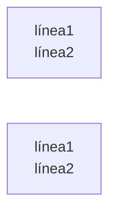

# Architecture Diagrams

## Table of Contents

- [Overview](#overview)
- [When to Use](#when-to-use)
- [Quick Start](#quick-start)
- [Reference Guides](#reference-guides)
- [Best Practices](#best-practices)

## Overview

Create clear, maintainable architecture diagrams using code-based diagramming tools like Mermaid and PlantUML for system design, data flows, and technical documentation.

## When to Use

- System architecture documentation
- C4 model diagrams (Context L1 · Container L2 · Component L3 · Code L4)
- Data flow diagrams
- Sequence diagrams
- Component relationships
- Deployment diagrams
- Infrastructure architecture
- Microservices architecture
- Database schemas (visual)
- Integration patterns

## Quick Start

Minimal working example:

```mermaid
graph TB
    subgraph "Client Layer"
        Web[Web App]
        Mobile[Mobile App]
        CLI[CLI Tool]
    end

    subgraph "API Gateway Layer"
        Gateway[API Gateway<br/>Rate Limiting<br/>Authentication]
    end

    subgraph "Service Layer"
        Auth[Auth Service]
        User[User Service]
        Order[Order Service]
        Payment[Payment Service]
        Notification[Notification Service]
    end

    subgraph "Data Layer"
        UserDB[(User DB<br/>PostgreSQL)]
        OrderDB[(Order DB<br/>PostgreSQL)]
        Cache[(Redis Cache)]
        Queue[Message Queue<br/>RabbitMQ]
    end
// ... (see reference guides for full implementation)
```

## Reference Guides

Detailed implementations in the `references/` directory:

| Guide | Contents |
|---|---|
| [System Architecture Diagram](references/system-architecture-diagram.md) | System Architecture Diagram |
| [Sequence Diagram](references/sequence-diagram.md) | Sequence Diagram |
| [C4 Context Diagram](references/c4-context-diagram.md) | C4 Level 1 — Sistema en su contexto (actores y sistemas externos) |
| [C4 Container Diagram](references/c4-container-diagram.md) | C4 Level 2 — Contenedores: tecnologías, deploys y comunicación interna |
| [Component Diagram](references/component-diagram.md) | C4 Level 3 — Componentes dentro de un contenedor |
| [Deployment Diagram](references/deployment-diagram.md) | Deployment Diagram |
| [Data Flow Diagram](references/data-flow-diagram.md) | Data Flow Diagram |
| [Class Diagram](references/class-diagram.md) | Class Diagram |
| [ITC Spec Templates](references/itc-spec-templates.md) | **Fábrica de datos ITC** — los 6 templates que mapean `spec.yaml` a Mermaid, la matriz de aplicabilidad por `type` y la cabecera de metadata. Los consume `fac-data-diagrams` |
|

## Best Practices

## Mermaid — Reglas de sintaxis obligatorias

### Saltos de línea dentro de nodos

| Sintaxis | Resultado |
|---|---|
| `\n` dentro de un nodo | ❌ Se renderiza como texto literal `\n` — NO usar |
| `<br/>` dentro de un nodo | ✅ Salto de línea real — siempre usar esto |



Esta regla aplica a **todos** los tipos de nodo: `[]`, `()`, `[()]`, `{}`, `[[]]`, etc.,
y en todos los tipos de diagrama: `graph`, `flowchart`, `sequenceDiagram`.

---

### ✅ DO

- Use consistent notation and symbols
- Include legends for complex diagrams
- Keep diagrams focused on one aspect
- Use color coding meaningfully
- Include titles and descriptions
- Version control your diagrams
- Use text-based formats (Mermaid, PlantUML)
- Show data flow direction clearly
- Include deployment details
- Document diagram conventions
- Keep diagrams up-to-date with code
- Use subgraphs for logical grouping
- **Use `<br/>` for line breaks inside nodes** (never `\n`)

### ❌ DON'T

- Overcrowd diagrams with details
- Use inconsistent styling
- Skip diagram legends
- Create binary image files only
- Forget to document relationships
- Mix abstraction levels in one diagram
- Use proprietary formats
- **Use `\n` for line breaks inside nodes** — it renders as literal text
