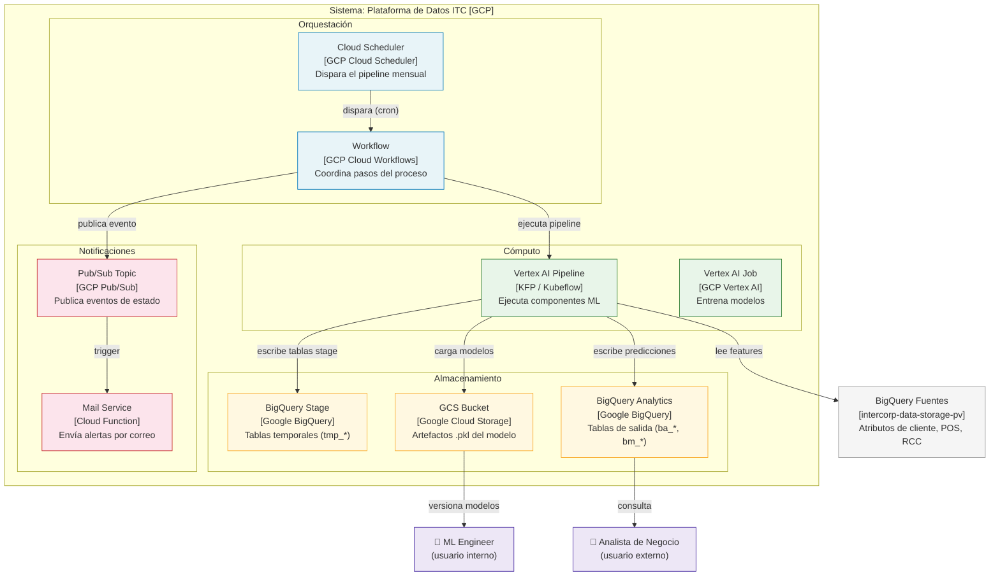
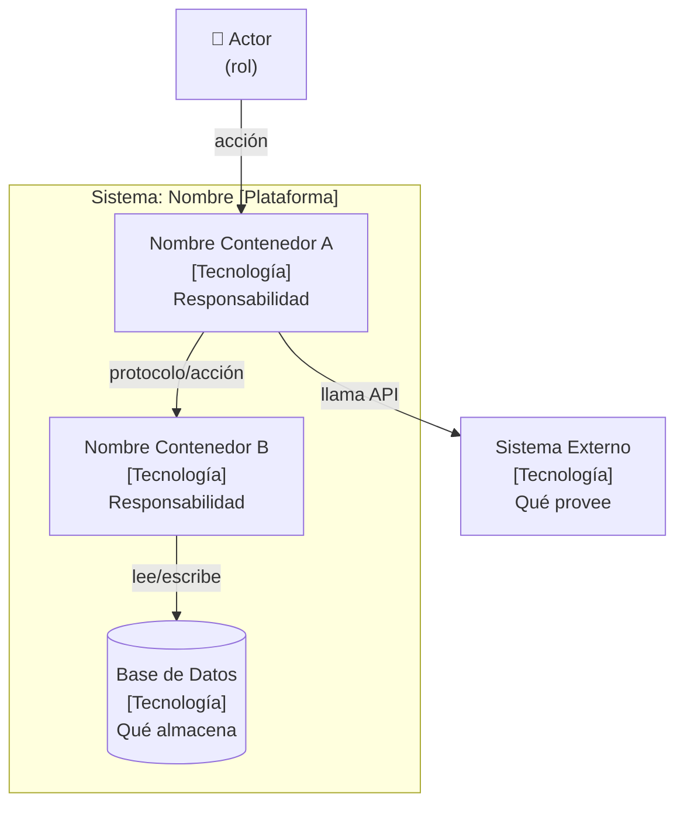

# C4 Container Diagram (Nivel 2)

El **Container Diagram** descompone el sistema del C4 Context en sus contenedores
ejecutables: aplicaciones web, APIs, bases de datos, colas de mensajes, pipelines, etc.
Cada contenedor es una unidad desplegable de forma independiente.

> **Cuándo usar:** cuando el Context Diagram ya está aprobado y el equipo necesita
> entender qué tecnologías componen el sistema y cómo se comunican entre sí.

---

## Ejemplo genérico — plataforma de datos (GCP)

---

## Convenciones del C4 Container Diagram

| Elemento | Representación | Descripción |
|----------|---------------|-------------|
| Contenedor interno | Nodo con subgraph + tecnología entre `[]` | Unidad desplegable del sistema |
| Sistema externo | Nodo fuera del boundary, color gris | Sistema que el tuyo consume o del que dependes |
| Actor / Usuario | Nodo con ícono 👤, fuera del boundary | Persona que interactúa con el sistema |
| Relación | Flecha con etiqueta describiendo el protocolo/acción | Comunicación entre contenedores |

### Leyenda de colores recomendada (ITC)

| Color | Significado |
|-------|------------|
| `#e8f4f8` azul claro | Orquestación (Scheduler, Workflow) |
| `#e8f5e9` verde claro | Cómputo / ML (Vertex AI, Cloud Run) |
| `#fff8e1` amarillo claro | Almacenamiento (BigQuery, GCS, Cloud SQL) |
| `#fce4ec` rosa claro | Eventos / Notificaciones (Pub/Sub, CF) |
| `#f5f5f5` gris | Sistemas externos |
| `#ede7f6` violeta claro | Actores / Usuarios |

---

## Plantilla mínima

---

## Relación con los otros niveles C4

| Nivel | Diagrama | Pregunta que responde |
|-------|----------|----------------------|
| L1 | [Context](c4-context-diagram.md) | ¿Quién usa el sistema y con qué otros sistemas se integra? |
| **L2** | **Container** *(este archivo)* | **¿Qué tecnologías componen el sistema y cómo se comunican?** |
| L3 | [Component](component-diagram.md) | ¿Qué componentes hay dentro de cada contenedor? |
| L4 | [Class / Code](class-diagram.md) | ¿Cómo está implementado cada componente? |
