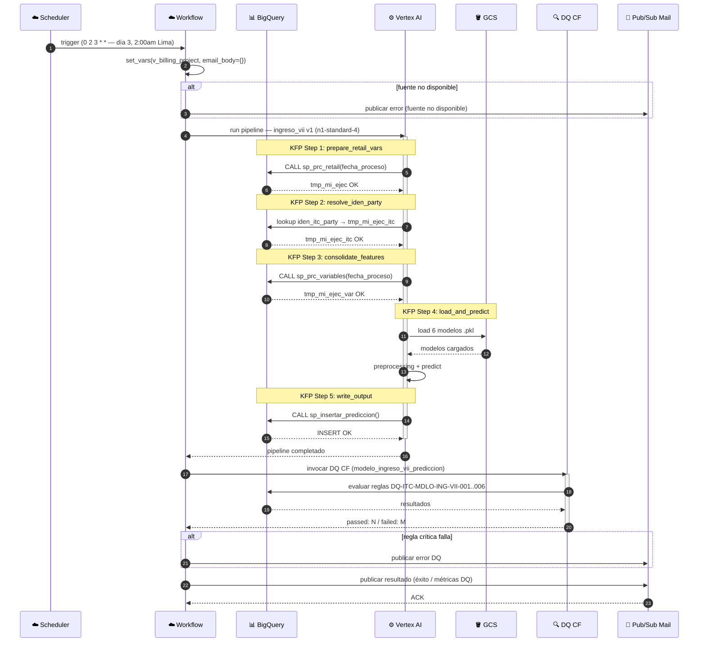

# Sequence Diagram

## Estructura canónica

Todo sequence diagram de datos debe incluir **dos secciones** en este orden:

1. **Flujo Principal** — pseudocódigo numerado con referencias a reglas de negocio (RN-XXX) y reglas DQ
2. **Diagrama de Secuencia** — Mermaid `sequenceDiagram` que refleja el mismo flujo visualmente

---

## Paso 1 — Flujo Principal (pseudocódigo)

Escribe el flujo dentro de un bloque de código. Convenciones:

```
TRIGGER: {fuente del trigger — Scheduler cron / HTTP / evento}
  SA: {sa_email}  [tipo: -job / -app]
  1. Verificar disponibilidad de fuentes  [RN-XXX]
     1a. Fuente no disponible → notificar + terminar en error
  2. Componente.método(params)  [RN-XXX]
     2a. Condición alternativa → resultado
  3. SP / ML / DQ paso
     3a. Error crítico → raise + notificar
  4. Escribir output
  5. Ejecutar DQ  [DQ-XXX-001..N]
     5a. Regla crítica falla → terminar en error + notificar
  6. Notificar resultado (éxito / error + métricas)
```

**Convenciones de nomenclatura:**
- SPs: `CALL sp_{nombre}(params)` — con tabla origen → tabla destino
- Vertex AI steps: `KFP.{nombre_componente}()` → artefacto intermedio
- Modelos ML: `load {modelo}.pkl` → `predict()` → campo de salida
- Reglas DQ: referenciar `[DQ-XXX-001]` en el paso de escritura o validación
- Reglas de negocio: referenciar `[RN-XXX]` en el paso donde se aplican

---

## Paso 2 — Diagrama de Secuencia Mermaid

Genera el diagrama usando `sequenceDiagram`. Reglas:

- **Participantes:** solo actores reales del proceso
  - `participant SCHED as ☁️ Scheduler` (si aplica)
  - `participant WF as ☁️ Workflow`
  - `participant VERTEX as ⚙️ Vertex AI` (si aplica)
  - `participant BQ as 📊 BigQuery`
  - `participant GCS as 🪣 GCS` (si aplica modelos/artefactos)
  - `participant DQ as 🔍 DQ CF` (si hay etapa DQ)
  - `participant MAIL as 📧 Pub/Sub Mail`
- **Flechas:** `->>`  llamada / invocación, `-->>` respuesta, `-x` error / falla
- **Bloques alt:** para flujos alternativos críticos (fuente no disponible, DQ falla)
- **Notes:** `Note over A,B:` para agrupar pasos por etapa (KFP step, SP, etc.)
- **activate/deactivate:** en componentes con procesamiento prolongado (Vertex pipeline)

---

## Ejemplo completo — pipeline vertex_ml

### Flujo Principal

```
TRIGGER: Cloud Scheduler — cron 0 2 3 * * (América/Lima)
  SA: ${env}-itc-ingreso-job@${env}-itc-customer-services.iam.gserviceaccount.com

  Workflow.set_vars(v_billing_project, email_body={})

  1. Verificar disponibilidad de fuentes attr_*
     1a. Fuente no disponible → publicar error + terminar

  2. KFP.prepare_retail_vars(fecha_proceso)
     CALL sp_prc_retail(fecha_proceso) → tmp_mi_ejec, tmp_mi_ejec_itc  [RN-ITC-006]

  3. KFP.resolve_iden_party()
     lookup iden_itc_party → tmp_mi_ejec_itc  [RN-ITC-006]

  4. KFP.consolidate_features(fecha_proceso)
     CALL sp_prc_variables(fecha_proceso) → tmp_mi_ejec_var

  5. KFP.load_and_predict()
     load 6 modelos .pkl desde GCS  [RN-ITC-005]
     preprocessing (estado_civil_map, nse_map, nivel_map, condicion_map)  [RN-ITC-001..004]
     predict → ingre_estimado, Prob_Clase_1..4, pred_ing_rng1..4

  6. KFP.write_output()
     CALL sp_insertar_prediccion() → INSERT modelo_ingreso_vii_prediccion  [DQ-ITC-MDLO-ING-VII-001..006]

  7. Workflow → DQ CF: evaluar 6 reglas DQ-ITC-MDLO-ING-VII-001..006
     7a. Regla crítica falla → publicar error + terminar

  8. Publicar resultado (éxito / error + métricas DQ) → Pub/Sub → mail
```

### Diagrama de Secuencia


    actor User
    participant Web as Web App
    participant Gateway as API Gateway
    participant Auth as Auth Service
    participant Order as Order Service
    participant Payment as Payment Service
    participant DB as Database
    participant Queue as Message Queue
    participant Email as Email Service

    User->>Web: Place Order
    Web->>Gateway: POST /orders
    Gateway->>Auth: Validate Token
    Auth-->>Gateway: Token Valid

    Gateway->>Order: Create Order
    Order->>DB: Save Order
    DB-->>Order: Order Saved
    Order->>Payment: Process Payment
    Payment->>Payment: Charge Card
    Payment-->>Order: Payment Success
    Order->>Queue: Publish Order Event
    Queue->>Email: Send Confirmation
    Email->>User: Order Confirmation

    Order-->>Gateway: Order Created
    Gateway-->>Web: 201 Created
    Web-->>User: Order Success

    Note over User,Email: Async email sent via queue
```
