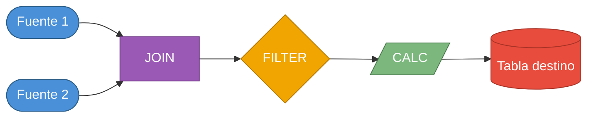

# Estándar: Brief Funcional — Documento de Requerimientos

> **Etapa:** PRE-PLAN — captura requerimientos de negocio antes de generar el `spec.yaml`
>
> El **Brief Funcional** es el artefacto que el solicitante (negocio / data analyst) entrega
> al equipo de la fábrica de datos para iniciar un desarrollo. Es la fuente de verdad **funcional**
> de la que deriva el `spec.yaml` técnico.

---

## Propósito y posición en el flujo

```
Brief Funcional (negocio)
        │
        ▼
  /spec-create    ← el ingeniero traduce el brief al spec.yaml estructurado
        │
        ▼
  spec.yaml (draft)
        │
        ▼
  SPEC APPROVAL    ← Stakeholders validan spec (status: approved)
        │
        ▼
  DISCOVERY        ← Mapear fuentes BigQuery, validar, enriquecer spec (NUEVO)
        │
        ▼
  spec.yaml (enriched)  ← actualizado con metadata real
        │
        ▼
  feature_spec/*/spec.md  ← detalle por módulo de output
```

El Brief Funcional **no reemplaza** al `spec.yaml` — lo alimenta. Un brief bien escrito
permite al ingeniero ejecutar `/spec-create` con mínima ambigüedad.

Después de la aprobación del spec, si el proyecto incluye fuentes BigQuery, se ejecuta
la etapa **DISCOVERY** (ver `@data/standard/factory/discovery.md`) para validar y enriquecer
el spec con metadata real antes de iniciar diseño.

---

## Secciones mínimas obligatorias

| # | Sección | Propósito |
|---|---------|-----------|
| 1 | **Identificación** | Datos administrativos del proyecto |
| 2 | **Problema / Objetivo de Negocio** | Por qué se hace — motivación y valor esperado |
| 3 | **Actores y Stakeholders** | Quién solicita, quién usa el output, data owner |
| 4 | **Casos de Uso** | Qué debe hacer el sistema — uno o varios UC-DATA |
| 5 | **Diagrama de Flujo del Pipeline** | Representación visual del flujo de componentes / pasos del proceso |
| 6 | **Fuentes de Datos** | Tablas / sistemas / archivos de entrada conocidos |
| 7 | **Output Esperado** | Qué debe producir: tabla BQ, archivo, API, modelo |
| 8 | **Reglas de Negocio** | Lógica de cálculo, transformaciones, restricciones |
| 9 | **Frecuencia y Volumen** | Cuándo corre y cuántos registros espera manejar |
| 10 | **Criterios de Aceptación** | KPIs y condiciones que deben cumplirse para dar por entregado |
| 11 | **Fuera de Alcance** | Qué NO incluye este desarrollo — evita scope creep |

> La sección 5 (Diagrama de Flujo) es obligatoria cuando el proceso tiene múltiples pasos o componentes.
> Puede ser un diagrama Mermaid, ASCII o una imagen adjunta. En migraciones desde Matillion,
> el diagrama se genera automáticamente desde el JSON export.

---

## Template

```markdown
# Brief Funcional — {Nombre del Proyecto}

**ID:** BRIEF-{EMPRESA}-{yyyymmdd}-{nnn}
**Fecha:** {fecha}
**Solicitante:** {nombre} ({área})
**Data Owner:** {email del responsable del dato}
**Prioridad:** Alta / Media / Baja
**Fecha objetivo:** {fecha esperada de entrega en producción}

---

## 1. Problema / Objetivo de Negocio

> *(Qué problema de negocio resuelve este desarrollo. Máx. 3 párrafos.)*

**Situación actual:**
{Describir el proceso manual o la brecha que existe hoy}

**Resultado esperado:**
{Qué cambia cuando este desarrollo esté en producción}

**Impacto estimado:**
{Áreas beneficiadas, decisiones que habilita, ahorro de tiempo estimado}

---

## 2. Actores y Stakeholders

| Rol | Nombre / Área | Responsabilidad |
|-----|--------------|-----------------|
| Solicitante | {nombre} / {área} | Define requerimientos funcionales |
| Data Owner | {email} | Aprueba definición del dato y accesos |
| Consumidor del Output | {área o sistema} | Lee / usa el resultado del proceso |
| Revisor Técnico | {tech lead} | Valida diseño y calidad del desarrollo |

---

## 3. Casos de Uso

### UC-DATA-001: {Nombre del caso de uso}

**Descripción:** {Qué hace en una oración}

**Trigger:** {¿Qué inicia el proceso? Scheduler mensual / evento / manual / API call}

**Flujo esperado (en lenguaje de negocio):**
1. {Paso 1 — qué obtiene de dónde}
2. {Paso 2 — qué transforma o calcula}
3. {Paso 3 — qué produce y dónde lo deja}

**Resultado:** {Qué produce al finalizar exitosamente}

**Flujos alternativos:**
- Si {condición}: {qué debe pasar}
- Si {error}: {cómo notificar / reintentar}

> *(Repetir bloque UC-DATA-XXX por cada caso de uso adicional)*

---

## 5. Diagrama de Flujo del Pipeline

> Representación visual del flujo de componentes. Usar Mermaid cuando sea posible.
> En migraciones Matillion: generado automáticamente por el skill `matillion-pipeline-mapper`.



---

## 6. Fuentes de Datos

| # | Nombre / Sistema | Descripción | Volumetría estimada | Disponibilidad |
|---|-----------------|-------------|---------------------|----------------|
| 1 | {tabla o sistema} | {qué contiene} | {filas aprox / mes} | {diaria / mensual / on-demand} |

**Restricciones de acceso conocidas:**
- {ej: tabla X contiene PII — solo usar para lookup}
- {ej: acceso cross-project a {proyecto} pendiente de gestión IAM}

---

## 7. Output Esperado

**Tipo de output:** Tabla BigQuery / Archivo GCS / API / Modelo ML

| Campo | Descripción | Tipo de dato | Ejemplo |
|-------|-------------|-------------|---------|
| {campo_1} | {descripción} | {STRING / INT / FLOAT / DATE} | {valor ejemplo} |
| {campo_2} | ... | ... | ... |

**Granularidad:** {un registro por cliente / por transacción / por fecha+cliente}
**Partición:** {fecha / sin partición / otra columna}
**Tipo de carga:** {reemplazo total / incremental / append}
**Destino:** `{proyecto}.{dataset}.{tabla}` *(si se conoce)*

---

## 8. Reglas de Negocio

| ID | Descripción | Campo afectado | Criticidad |
|----|-------------|---------------|-----------|
| RN-{PRY}-001 | {descripción de la regla — qué calcular, qué validar, qué transformar} | {campo} | Alta / Media |

> *(Incluir aquí lógica de clasificación, diccionarios de encoding, fórmulas de cálculo,
> condiciones de filtro, reglas de join, etc.)*

---

## 9. Frecuencia y Volumen

| Atributo | Valor |
|----------|-------|
| Frecuencia de ejecución | {diaria / semanal / mensual / on-demand} |
| Día/hora de ejecución | {ej: día 3 de cada mes a las 2:00am Lima} |
| Volumen de input estimado | {ej: ~40M filas por proceso} |
| Volumen de output estimado | {ej: ~2M registros por partición} |
| SLA de disponibilidad | {ej: disponible antes del día 5 de cada mes} |

---

## 10. Criterios de Aceptación

| # | Criterio | Métrica | Umbral |
|---|---------|---------|--------|
| CA-001 | {qué se mide} | {cómo se mide} | {valor mínimo aceptable} |
| CA-002 | Cobertura de clientes activos | % clientes con output generado | ≥ 90% |
| CA-003 | Disponibilidad en tiempo | Pipeline completado antes del SLA | Día 5 de cada mes |
| CA-004 | Sin errores en producción | Ejecuciones fallidas en primeros 3 meses | 0 |

---

## 11. Fuera de Alcance

- {Lo que explícitamente NO incluye este desarrollo}
- {Funcionalidades que se dejan para una v2}
- {Dependencias externas que el equipo de datos no puede resolver}

---

## 12. Adjuntos / Referencias

| Tipo | Descripción | Link / Ruta |
|------|-------------|-------------|
| Script origen | Notebook o script de referencia con la lógica actual | {ruta o link} |
| Datos de muestra | Archivos de ejemplo del input | {ruta} |
| Documentación fuente | Manual, especificación previa | {link} |
```

---

## Ejemplo práctico — Modelo de Ingresos VII

```markdown
# Brief Funcional — Productivización Modelo de Ingresos VII

**ID:** BRIEF-ITC-20260301-001
**Fecha:** 2026-03-01
**Solicitante:** Equipo de Modelos Analíticos (fernando.foh)
**Data Owner:** fernando.foh@intercorp.com.pe
**Prioridad:** Alta
**Fecha objetivo:** 2026-05-01 (primera ejecución en producción)

---

## 1. Problema / Objetivo de Negocio

**Situación actual:**
El modelo de estimación de ingresos (versión VII) se ejecuta manualmente cada mes
desde un notebook Jupyter por parte del equipo de modelos. El proceso toma entre
4 y 6 horas, requiere intervención humana y no tiene trazabilidad ni alertas automáticas.
Hay riesgo de error humano y dependencia de una sola persona.

**Resultado esperado:**
El pipeline corre automáticamente el día 3 de cada mes a las 2:00am sin intervención
humana. Las predicciones están disponibles en BigQuery antes del día 5. El equipo de
scoring crediticio consume el resultado directamente desde la tabla de analytics.

**Impacto estimado:**
- Elimina 4-6 horas de trabajo manual mensual
- Disponibilidad garantizada para el proceso de scoring crediticio
- Trazabilidad completa: logs, alertas por mail, reglas de calidad automáticas

---

## 2. Actores y Stakeholders

| Rol | Nombre / Área | Responsabilidad |
|-----|--------------|-----------------|
| Solicitante | fernando.foh / Modelos Analíticos | Define lógica del modelo y reglas de negocio |
| Data Owner | fernando.foh@intercorp.com.pe | Aprueba definición del dato y accesos |
| Consumidor del Output | Equipo de Scoring Crediticio | Consume `modelo_ingreso_vii_prediccion` |
| Revisor Técnico | Tech Lead Data Platform | Valida diseño, calidad y estándares |

---

## 3. Casos de Uso

### UC-DATA-001: Inferencia mensual del modelo de ingresos

**Descripción:** Ejecutar el pipeline de estimación de ingresos VII de forma automática
y escribir las predicciones en BigQuery.

**Trigger:** Cloud Scheduler — día 3 de cada mes a las 2:00am (America/Lima)

**Flujo esperado:**
1. Verificar que los atributos de cliente (demográficos, seguros, POS, RCC) ya están
   cargados para el mes en curso
2. Preparar variables retail: cruzar transacciones SPSA con identidad Intercorp
3. Consolidar features desde los atributos de cliente
4. Cargar los 6 modelos .pkl desde GCS y generar predicciones de ingresos
5. Escribir las predicciones en la tabla de analytics (reemplazo mensual)
6. Validar calidad del output: completitud, unicidad, rango de valores
7. Notificar resultado por correo al equipo (éxito o error con detalle)

**Resultado:** Tabla `modelo_ingreso_vii_prediccion` disponible con predicciones
para todos los clientes activos con identidad Intercorp resuelta.

**Flujos alternativos:**
- Si un atributo fuente no está disponible: notificar por mail y no ejecutar
- Si la cobertura de clientes es < 90%: marcar como error de calidad y notificar

---

## 4. Fuentes de Datos

| # | Nombre / Sistema | Descripción | Volumetría estimada | Disponibilidad |
|---|-----------------|-------------|---------------------|----------------|
| 1 | `tee_trn_retail_spsa` | Cabecera transacciones retail SPSA | Por confirmar | Mensual |
| 2 | `tem_item_retail_spsa` | Detalle ítems de transacciones retail | Por confirmar | Mensual |
| 3 | `iden_itc_party` | Identidad Intercorp — resolución de clientes | ~467M filas | Continua |
| 4 | `ba_itc_attr_demographic` | Atributos demográficos del cliente | ~40M filas / mes | Mensual |
| 5 | `ba_itc_attr_insurance` | Productos de seguros contratados | ~82M filas / mes | Mensual |
| 6 | `ba_itc_attr_payment_pos` | Comportamiento en pagos POS | ~323M filas / mes | Mensual |
| 7 | `ba_itc_attr_rcc` | Reporte Crediticio Consolidado SBS | ~731M filas / mes | Mensual |

**Restricciones de acceso:**
- `iden_itc_party` contiene tipo_doc / nro_doc (PII) — usar solo para lookup de id_sandbox, no persistir
- `tee_trn_retail_spsa` contiene datos de clientes — no persistir campos sensibles en el output
- Fuentes en proyecto externo `intercorp-data-storage-pv` — requiere permisos cross-project

---

## 5. Output Esperado

**Tipo de output:** Tabla BigQuery

| Campo | Descripción | Tipo | Ejemplo |
|-------|-------------|------|---------|
| `fecha` | Fecha del proceso (partición) | DATE | 2026-03-03 |
| `id_sandbox` | Identificador del cliente en el sandbox | STRING | sb_00123456 |
| `ingre_estimado` | Ingreso mensual estimado final | FLOAT64 | 3500.75 |
| `Prob_Clase_1` | Probabilidad clase 1 (ingresos bajos) | FLOAT64 | 0.12 |
| `Prob_Clase_2` | Probabilidad clase 2 | FLOAT64 | 0.65 |
| `Prob_Clase_3` | Probabilidad clase 3 (ingresos altos) | FLOAT64 | 0.23 |
| `Prob_Clase_4` | Probabilidad clase 4 (refinamiento clase 2) | FLOAT64 | 0.40 |
| `pred_ing_rng1..4` | Ingreso estimado por rango | FLOAT64 | 2100.00 |
| `estado` | Estado del registro (OK / ERROR) | STRING | OK |

**Granularidad:** Un registro por cliente (`id_sandbox`) por mes (`fecha`)
**Partición:** `fecha`
**Tipo de carga:** Reemplazo total mensual
**Destino:** `${project_analytics}.analytics.modelo_ingreso_vii_prediccion`

---

## 6. Reglas de Negocio

| ID | Descripción | Campo afectado | Criticidad |
|----|-------------|---------------|-----------|
| RN-ITC-001 | Encoding estado civil: `{'S':1,'C':2,'V':3,'D':4,'U':5,'N':6}` — copiar literalmente del script origen | `estado_civil_encoded` | Alta |
| RN-ITC-002 | Encoding NSE: `{'A':1,'B':2,'C':3,'D':4,'E':5}` | `nse_encoded` | Alta |
| RN-ITC-003 | Encoding nivel educativo (~35 valores) — copiar íntegramente del script origen sin renombrar claves | `nivel_educativo_encoded` | Alta |
| RN-ITC-004 | Encoding condición: `{'A':1,'T':2,'J':3,'P':4,'N':5,'F':6}` | `condicion_encoded` | Alta |
| RN-ITC-005 | Secuencia fija de 6 modelos: mul_clase3 → clase2 → rango{1,2,3,4}. No alterar el orden | `ingre_estimado` | Alta |
| RN-ITC-006 | SP retail debe ejecutarse primero. Lookup iden_itc_party antes de consolidar atributos | `id_sandbox` | Alta |

---

## 7. Frecuencia y Volumen

| Atributo | Valor |
|----------|-------|
| Frecuencia | Mensual |
| Día/hora | Día 3 de cada mes a las 2:00am (America/Lima) |
| Volumen input estimado | ~731M filas (RCC, el mayor) |
| Volumen output estimado | ~2M clientes activos / mes |
| SLA de disponibilidad | Predicciones disponibles antes del día 5 de cada mes |

---

## 8. Criterios de Aceptación

| # | Criterio | Métrica | Umbral |
|---|---------|---------|--------|
| CA-001 | Disponibilidad puntual | Pipeline completado antes del día 5 | ✅ Siempre |
| CA-002 | Cobertura de clientes | % clientes activos con id_sandbox resuelto | ≥ 90% |
| CA-003 | Completitud del output | % registros con `ingre_estimado` no nulo | 100% |
| CA-004 | Unicidad | Duplicados en `id_sandbox + fecha` | 0 |
| CA-005 | Estabilidad inicial | Ejecuciones sin error en primeros 3 meses | 0 errores |

---

## 9. Fuera de Alcance

- Reentrenamiento automático del modelo — los 6 .pkl son inmutables en v1
- Monitoreo de drift del modelo (se evalúa para v2)
- Exposición de resultados vía API REST
- Integración directa con el sistema de scoring (el equipo consumidor accede a BQ directamente)

---

## 10. Adjuntos / Referencias

| Tipo | Descripción | Ruta |
|------|-------------|------|
| Script origen | Notebook con lógica de ejecución manual del modelo | `input/Scripts/Ejecucion Modelo de Ingresos.txt` |
| Modelos serializados | 6 archivos .pkl del modelo entrenado | `input/Modelos/` |
| Script de variables | Lógica de preparación de features | `input/Scripts/` |
```

---

## Relación con el `spec.yaml`

Cada sección del brief tiene correspondencia directa con el `spec.yaml`:

| Sección Brief | Campo `spec.yaml` |
|--------------|-------------------|
| Identificación | `contexto.nombre`, `contexto.empresa`, `contexto.data_owner` |
| Objetivo de Negocio | `contexto.descripcion`, `kpis[]` |
| Actores | `contexto.data_owner`, `contexto.solicitante` |
| Casos de Uso | genera `docs/feature_spec/{slug}/spec.md` |
| Fuentes de Datos | `fuentes[]` con `tabla_canonica`, `particion`, `pii` |
| Output Esperado | `outputs[]` con `tabla`, `tipo_carga`, `particion`, `campos[]` |
| Reglas de Negocio | `reglas_negocio[]` en `feature_spec/*/spec.md` |
| Frecuencia | `scheduling.cron`, `scheduling.frecuencia` |
| Criterios de Aceptación | `kpis[]`, `data_quality.reglas[]` |

> El ingeniero usa el brief como input del comando `/spec-create` para generar el `spec.yaml`.
> Un brief completo = un `/spec-create` sin preguntas de aclaración.


