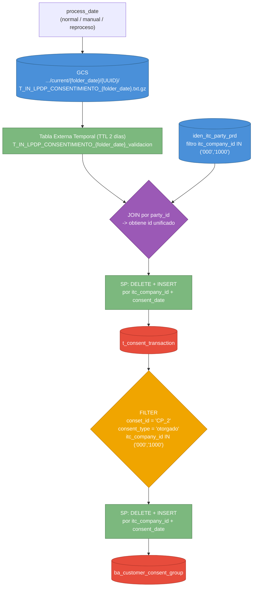

# Brief Funcional — Centralización de Consentimientos LPDP Interbank (IBK)

**ID:** BRIEF-IBK-20260819-001
**Fecha:** 2026-08-19
**Solicitante:** Por definir (equipo negocio / LPDP Interbank)
**Data Owner:** Por definir (línea LPDP / Consentimiento Interbank)
**Prioridad:** Alta (cumplimiento normativo de tratamiento de datos personales)
**Fecha objetivo:** Por definir

---

## 1. Problema / Objetivo de Negocio

**Situación actual:**
Interbank (IBK) genera diariamente un archivo con los eventos de consentimiento/rechazo
de tratamiento de datos personales (LPDP) de sus clientes, entregado en Cloud Storage.
Hoy no existe un proceso automatizado que centralice esta información en el modelo de
datos corporativo ITC: no hay una tabla única de transacciones de consentimiento, ni una
tabla agregada de consentimientos otorgados por cliente.

**Resultado esperado:**
Un pipeline diario (orquestado como Workflow) que: (1) lee el archivo diario de IBK vía
tabla externa temporal, (2) centraliza cada evento de consentimiento en `t_consent_transaction`
resolviendo el identificador único de cliente contra `iden_itc_party`, y (3) deriva de allí
la tabla `ba_customer_consent_group` con los consentimientos vigentes otorgados (`CP_2`).
El proceso debe soportar ejecución normal (fecha de sistema), ejecución manual con fecha
específica, y reproceso por rango de fechas.

**Impacto estimado:**
- Trazabilidad centralizada y auditable de los consentimientos LPDP de clientes IBK.
- Identificación unificada del cliente a nivel Grupo Intercorp (vía `iden_itc_party`).
- Base para reportes/controles de cumplimiento normativo sobre consentimientos otorgados.

---

## 2. Actores y Stakeholders

| Rol | Nombre / Área | Responsabilidad |
|-----|--------------|-----------------|
| Solicitante | Por definir / Negocio-LPDP Interbank | Define reglas de consentimiento y códigos de empresa válidos |
| Data Owner | Por definir | Aprueba definición del dato y accesos a fuentes IBK |
| Consumidor del Output | Por definir (Cumplimiento / LPDP / Analítica) | Consume `t_consent_transaction` y `ba_customer_consent_group` |
| Revisor Técnico | Tech Lead Data Platform | Valida diseño, estándares de nomenclatura y calidad |

---

## 3. Casos de Uso

### UC-DATA-001: Centralización diaria de consentimientos LPDP Interbank

**Descripción:** Leer el archivo diario de consentimientos de IBK desde Cloud Storage,
centralizarlo en `t_consent_transaction` (resolviendo identidad ITC) y derivar de allí
la tabla agregada `ba_customer_consent_group`.

**Trigger:** Workflow orquestado (SPs encadenados), ejecución diaria. Soporta 3 modos de
invocación: normal, manual y reproceso (ver sección 8 — Frecuencia y Volumen).

**Flujo esperado (en lenguaje de negocio):**
1. Determinar el `process_date` de la ejecución según el escenario (normal/manual/reproceso)
   y calcular la fecha de carpeta (`folder_date`) del archivo a leer en GCS.
2. Crear (`CREATE OR REPLACE`) la tabla externa temporal apuntando al archivo del día
   correspondiente en `gs://p-ibkbi-rdp-stg-dlk-us-suoh/data/m_consent/current/{folder_date}/{UUID}/T_IN_LPDP_CONSENTIMIENTO_{folder_date}.txt.gz`.
   Esta tabla externa vive un máximo de 2 días.
3. Cruzar los registros leídos por `party_id` contra `iden_itc_party_prd`
   (`dev-intercorp-data_operation.matillion_dev.iden_itc_party_prd`), filtrando
   `itc_company_id IN ('000','1000')`, para obtener el identificador unificado `id`.
4. Ejecutar el SP de carga a `t_consent_transaction`: **DELETE + INSERT** de las
   particiones (`itc_company_id` + `consent_date`) presentes en el batch leído. El
   `consent_date` usado como llave de borrado/partición es el que trae cada registro
   en el archivo (no se calcula por offset fijo — ver Regla de Negocio RN-IBK-004).
5. Ejecutar el SP de carga a `ba_customer_consent_group`, tomando **únicamente**
   `t_consent_transaction` como fuente, filtrando `conset_id = 'CP_2'`,
   `consent_type = 'otorgado'` y `itc_company_id IN ('000','1000')`. Carga también
   **DELETE + INSERT** por `itc_company_id` + `consent_date`.

**Resultado:** `t_consent_transaction` y `ba_customer_consent_group` actualizadas para
las particiones (`itc_company_id`, `consent_date`) correspondientes al batch procesado.

**Flujos alternativos:**
- **Flujo normal:** sin parámetros. `process_date` = fecha de sistema (`CURRENT_DATE()`).
- **Flujo manual:** se recibe `process_date` (ej. `"2026-04-01"`) y se usa como fecha base
  para calcular `folder_date` y ejecutar una sola vez el pipeline completo para ese día.
- **Flujo reproceso:** se reciben `process_date_init` y `process_date_fin` (ej.
  `"2026-01-01"` a `"2026-08-01"`). El pipeline completo (pasos 1-5) se ejecuta una vez
  por cada día del rango, en orden secuencial, tratando cada día como un "flujo manual".
- Si el archivo del día no existe en la ruta esperada: la tabla externa no encuentra
  objetos y el SP no debe generar DELETE sin datos de reemplazo (evitar borrar partición
  sin insertar). Notificar/alertar — política de reintento a confirmar con negocio.
- Si `iden_itc_party_prd` no tiene match para un `party_id`: definir con negocio si el
  registro se descarta o se inserta con `id` nulo (ver sección 13).

---

## 4. Diagrama de Flujo del Pipeline

> Todo el flujo (creación/gestión de la tabla externa + los dos SP) se orquesta como un
> único **Workflow**, parametrizable por `process_date` / `process_date_init` / `process_date_fin`.

---

## 5. Fuentes de Datos

| # | Nombre / Sistema | Descripción | Volumetría estimada | Disponibilidad |
|---|-----------------|-------------|---------------------|----------------|
| 1 | `T_IN_LPDP_CONSENTIMIENTO_{folder_date}` (GCS, tabla externa temporal) | Archivo diario `.txt.gz` con eventos de consentimiento LPDP de clientes IBK. DDL: `input/ddl_table_external.txt` | Por confirmar | Diaria — ruta `gs://p-ibkbi-rdp-stg-dlk-us-suoh/data/m_consent/current/{folder_date}/{UUID}/...` |
| 2 | `iden_itc_party_prd` | Identidad unificada de persona a nivel Grupo Intercorp. Proyecto `dev-intercorp-data_operation`, dataset `matillion_dev` | Por confirmar | Continua |
| 3 | `t_consent_transaction` | Fuente única para generar `ba_customer_consent_group` (es el output del paso anterior del mismo pipeline) | = volumen de eventos diarios IBK | Diaria (recién cargada por este mismo proceso) |

**Restricciones de acceso conocidas:**
- La tabla externa referenciada en `input/ddl_table_external.txt` está definida sobre el
  proyecto/dataset personal de desarrollo `dev-intercorp-data-storage.lsullon` — para
  productivo debe reubicarse en un dataset compartido (ej. `master_stage`), según
  `data/standard/architecture/data-platform-layers.md`.
- `iden_itc_party_prd` vive en un proyecto distinto (`dev-intercorp-data_operation`) —
  requiere permisos cross-project (`bigquery.dataViewer`) para el Service Account del proceso.
- El archivo de origen puede contener PII (`documento_legal_id`, `signed_document`, etc.) —
  confirmar si requiere encriptación AEAD según el estándar de datos sensibles.

---

## 6. Output Esperado

**Tipo de output:** 2 tablas BigQuery (zona Master, dataset `master_party`)

### 6.1 `t_consent_transaction`

DDL: `input/ddl_output_t_consent_transaction.txt`

| Campo destino | Origen | Tipo | Notas |
|---|---|---|---|
| `process_date` | Fecha de foto configurada en el ETL | DATE | Confirmar si es `process_date` del run o `folder_date` |
| `itc_company_id` / `itc_company_name` | Archivo IBK | STRING | Directo |
| `business_unit_id` / `business_unit` | Archivo IBK | STRING | Directo |
| `conset_transaction_id` | `consent_transaction_id` (archivo) | STRING | Nombre de columna destino difiere del origen (typo histórico `conset_`) |
| `customer_id` | `party_id` (archivo) | STRING | Identificador del cliente en el sistema origen IBK |
| `id` | `iden_itc_party_prd.id` (vía JOIN por `party_id`) | STRING | Identificador unificado ITC — RN-IBK-003 |
| `conset_id` | `consent_id` (archivo) | STRING | Nombre de columna destino difiere del origen |
| `documento_legal_id`, `approval_channel_id`, `employee_id`, `place_id`, `consent_type`, `signed_document` | Archivo IBK | STRING | Directo |
| `consent_date` | `consent_date` (archivo, STRING → DATE) | DATE | **Partición.** Se usa el valor real del archivo, no un cálculo por offset (RN-IBK-004) |
| `record_source`, `creation_user` | Auditoría del proceso | STRING | Confirmar si se copia del archivo o se fija por el SP |
| `load_date` | Auditoría del proceso | TIMESTAMP | `CURRENT_TIMESTAMP()` al momento de la carga |

**Campos del archivo NO utilizados en este destino:** `approval_channel_name`, `consent_date_time`
(ver sección 13 — se requieren para `ba_customer_consent_group` pero no se persisten aquí).

**Granularidad:** Un registro por evento de consentimiento (`conset_transaction_id`)
**Partición:** `consent_date`. Clustering: `itc_company_name`
**Tipo de carga:** DELETE + INSERT por `itc_company_id` + `consent_date`
**Destino:** `dev-intercorp-data-storage.master_party.t_consent_transaction`

### 6.2 `ba_customer_consent_group`

DDL: `input/ddl_output_ba_customer_consent_group.txt`

| Campo destino | Origen | Tipo | Notas |
|---|---|---|---|
| `process_date`, `itc_company_id`, `itc_company_name`, `business_unit_id`, `business_unit` | `t_consent_transaction` | DATE/STRING | Directo |
| `id` | `t_consent_transaction.id` | STRING | Identificador unificado ITC ya resuelto |
| `documento_legal_id`, `approval_channel_id`, `employee_id`, `place_id`, `signed_document` | `t_consent_transaction` | STRING | Directo |
| `approval_channel_name` | **Pendiente de origen** | STRING | No existe en `t_consent_transaction` — ver sección 13 |
| `consent_date` | `t_consent_transaction.consent_date` | DATE | **Partición** |
| `record_source`, `creation_user` | Auditoría del proceso | STRING | — |
| `load_date` | Auditoría del proceso | DATETIME | Al momento de la carga |

**Filtro de entrada:** `conset_id = 'CP_2'` AND `consent_type = 'otorgado'` AND `itc_company_id IN ('000','1000')`
**Granularidad:** Un registro por cliente (`id`) con consentimiento `CP_2` otorgado, por `consent_date`
**Partición:** `consent_date`
**Tipo de carga:** DELETE + INSERT por `itc_company_id` + `consent_date`
**Destino:** `dev-intercorp-data-storage.master_party.ba_customer_consent_group`

---

## 7. Reglas de Negocio

| ID | Descripción | Campo afectado | Criticidad |
|----|-------------|---------------|-----------|
| RN-IBK-001 | La tabla externa temporal se recrea diariamente (`CREATE OR REPLACE EXTERNAL TABLE`) apuntando a la ruta GCS del día, y tiene una vigencia máxima de 2 días. | Tabla externa `T_IN_LPDP_CONSENTIMIENTO_{folder_date}_validacion` | Alta |
| RN-IBK-002 | El `folder_date` (`{YYYYMMDD}` de la ruta GCS y del nombre de tabla externa) se calcula como `process_date - 1 día` (asumido según ejemplo de negocio; **confirmar exactitud del offset**). | Ruta GCS / nombre tabla externa | Alta |
| RN-IBK-003 | Antes de insertar en `t_consent_transaction`, cruzar por `party_id` contra `dev-intercorp-data_operation.matillion_dev.iden_itc_party_prd`, filtrando `itc_company_id IN ('000','1000')`, para obtener el `id` unificado ITC que se inserta en destino. | `id` | Alta |
| RN-IBK-004 | El `consent_date` usado como llave de partición/borrado en `t_consent_transaction` es el valor real contenido en cada registro del archivo — **no se deriva por un offset fijo**, ya que el desfase entre `folder_date` y el `consent_date` del contenido no es constante (ejemplo observado: ~2 días de desfase respecto a la fecha de sistema). | `consent_date` | Alta |
| RN-IBK-005 | Carga a `t_consent_transaction` es DELETE + INSERT: se eliminan previamente los registros de `itc_company_id` + `consent_date(s)` presentes en el batch, antes de insertar los nuevos. | `t_consent_transaction` | Alta |
| RN-IBK-006 | `ba_customer_consent_group` se genera **exclusivamente** a partir de `t_consent_transaction` (no vuelve a leer el archivo ni la tabla externa), filtrando `conset_id = 'CP_2'`, `consent_type = 'otorgado'` e `itc_company_id IN ('000','1000')`. | `ba_customer_consent_group` | Alta |
| RN-IBK-007 | Carga a `ba_customer_consent_group` es DELETE + INSERT por `itc_company_id` + `consent_date`, igual que en `t_consent_transaction`. | `ba_customer_consent_group` | Alta |
| RN-IBK-008 | El pipeline completo (tabla externa + SP `t_consent_transaction` + SP `ba_customer_consent_group`) se implementa como Stored Procedures orquestados en un único Workflow. | Orquestación | Alta |
| RN-IBK-009 | El Workflow soporta 3 modos de ejecución mutuamente excluyentes: normal (sin parámetros), manual (`process_date` único) y reproceso (`process_date_init` + `process_date_fin`, ejecutando un ciclo completo por cada día del rango). Ver tabla en sección 8. | Parámetros de ejecución | Alta |

---

## 8. Frecuencia y Volumen

| Atributo | Valor |
|----------|-------|
| Frecuencia de ejecución | Diaria (flujo normal) |
| Día/hora de ejecución | Por definir |
| Volumen de input estimado | Por confirmar con Interbank |
| Volumen de output estimado | Por confirmar (1:1 aprox. con input en `t_consent_transaction`; subconjunto filtrado en `ba_customer_consent_group`) |
| SLA de disponibilidad | Por definir |

**Escenarios de cálculo de fecha:**

| Escenario | Parámetro(s) de entrada | `process_date` usado | `folder_date` (ruta GCS) | Ejecuciones |
|---|---|---|---|---|
| Normal | Ninguno | `CURRENT_DATE()` (fecha de sistema) | `process_date - 1 día` | 1, para el día de hoy |
| Manual | `process_date = "2026-04-01"` | Valor recibido | `process_date - 1 día` | 1, para la fecha indicada |
| Reproceso | `process_date_init = "2026-01-01"`, `process_date_fin = "2026-08-01"` | Cada día del rango `[init, fin]` | `process_date_dia - 1 día` | N (una por cada día del rango, secuencial, cada una equivalente a un "flujo manual") |

> En los tres escenarios, el `consent_date` real usado para el DELETE+INSERT se sigue
> leyendo del contenido del archivo (RN-IBK-004) — el `process_date`/`folder_date` solo
> determina **qué archivo leer**, no la partición de destino.

---

## 9. Criterios de Aceptación

| # | Criterio | Métrica | Umbral |
|---|---------|---------|--------|
| CA-001 | La tabla externa lee correctamente el archivo del día calculado | Archivo encontrado en la ruta `folder_date` esperada | 100% de los días con archivo disponible |
| CA-002 | Resolución de identidad ITC | % de registros con `id` resuelto vía `iden_itc_party_prd` | ≥ 90% (a validar con Data Owner) |
| CA-003 | Reproceso no duplica datos | Duplicados en `t_consent_transaction` por `itc_company_id + consent_date + conset_transaction_id` tras reproceso | 0 |
| CA-004 | Consistencia entre tablas | Todo registro en `ba_customer_consent_group` corresponde a un `conset_id='CP_2'` y `consent_type='otorgado'` en `t_consent_transaction` | 100% |
| CA-005 | Vigencia de tabla externa | La tabla externa temporal no persiste más de 2 días | 100% de las tablas expiradas/limpiadas a tiempo |
| CA-006 | Flujo manual y reproceso funcionales | Ejecución exitosa con `process_date` único y con rango `process_date_init/fin` | Sin errores en pruebas de los 3 escenarios |

---

## 10. Fuera de Alcance

- Definición y mantenimiento del catálogo de `approval_channel_id` / `approval_channel_name`
  (si se requiere una tabla catálogo aparte, es un desarrollo adicional a evaluar).
- Encriptación AEAD de campos PII — se evalúa como paso posterior si Data Owner lo confirma.
- Notificaciones/alertas de fallo del Workflow (política de reintentos) — a definir en diseño.
- Consumo del output (dashboards, reportes de cumplimiento LPDP) — fuera de este desarrollo.
- Historización de archivos crudos más allá del bucket de origen (`current/`) — no se define
  archivado propio en este brief.

---

## 11. Adjuntos / Referencias

| Tipo | Descripción | Ruta |
|------|-------------|------|
| DDL tabla externa | Definición de la tabla externa temporal sobre el archivo diario IBK | `input/ddl_table_external.txt` |
| DDL output 1 | Definición de `t_consent_transaction` | `input/ddl_output_t_consent_transaction.txt` |
| DDL output 2 | Definición de `ba_customer_consent_group` | `input/ddl_output_ba_customer_consent_group.txt` |
| Estándar de capas | Convenciones de nomenclatura, Cloud Storage y particionamiento | `data/standard/architecture/data-platform-layers.md` |
| Estándar de brief | Plantilla usada para este documento | `data/standard/factory/functional-brief.md` |

---

## 12. Supuestos y Preguntas Abiertas (pendientes de validar con negocio/Interbank)

1. **Offset de `folder_date`:** se asumió `process_date - 1 día` a partir del único
   ejemplo dado (sistema 2026-08-19 → carpeta `20260818`). Confirmar si este offset es
   siempre exactamente 1 día.
2. **Desfase del `consent_date` de contenido:** el ejemplo muestra ~2 días respecto a la
   fecha de sistema, pero el enunciado aclara que es variable ("casi 2 días") — por eso
   se definió leer el valor real del archivo en vez de calcularlo. Confirmar que esta
   interpretación es correcta.
3. **`approval_channel_name` en `ba_customer_consent_group`:** este campo no existe en
   `t_consent_transaction`, pero sí en el archivo origen y en el destino agregado. Definir
   si (a) se agrega `approval_channel_name` a `t_consent_transaction`, o (b) se resuelve
   vía catálogo por `approval_channel_id` en el segundo SP.
4. **Campos no persistidos:** `consent_date_time` del archivo no tiene destino definido en
   ninguna de las dos tablas — confirmar si se descarta intencionalmente.
5. **Alcance del filtro `itc_company_id IN ('000','1000')` contra `iden_itc_party_prd`:**
   confirmar si el filtro aplica sobre el campo `itc_company_id` de los registros del
   archivo IBK, de la tabla `iden_itc_party_prd`, o de ambos.
6. **Registros sin match en `iden_itc_party_prd`:** definir si se descartan, se insertan
   con `id` nulo, o se marcan para revisión (impacta CA-002).
7. **Ubicación final de la tabla externa:** el DDL de referencia usa el dataset personal
   `dev-intercorp-data-storage.lsullon` — confirmar dataset compartido definitivo (ej.
   `master_stage`) para el desarrollo productivo.
8. **Motor de orquestación del Workflow:** el enunciado indica "SP" + "workflow" pero no
   especifica la herramienta (Cloud Workflows, Composer, Matillion) — a definir en DISEÑO.
9. **Manejo de archivo ausente:** qué hacer si no llega el archivo esperado para el
   `folder_date` calculado (reintento, alerta, o skip) — no debe ejecutarse un DELETE sin
   el correspondiente INSERT de reemplazo.
